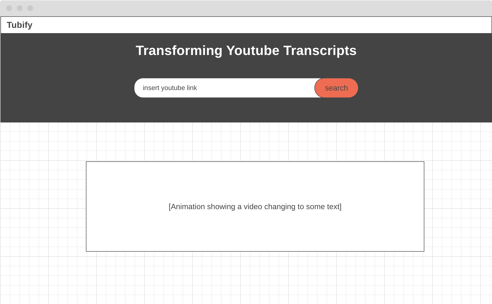
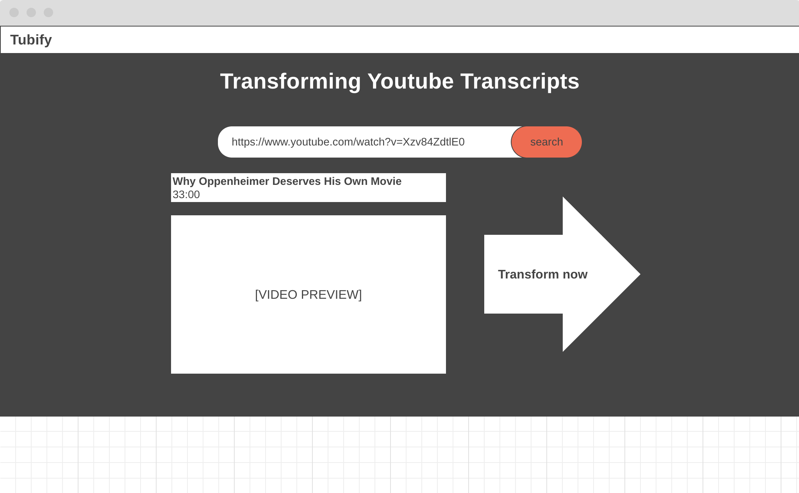
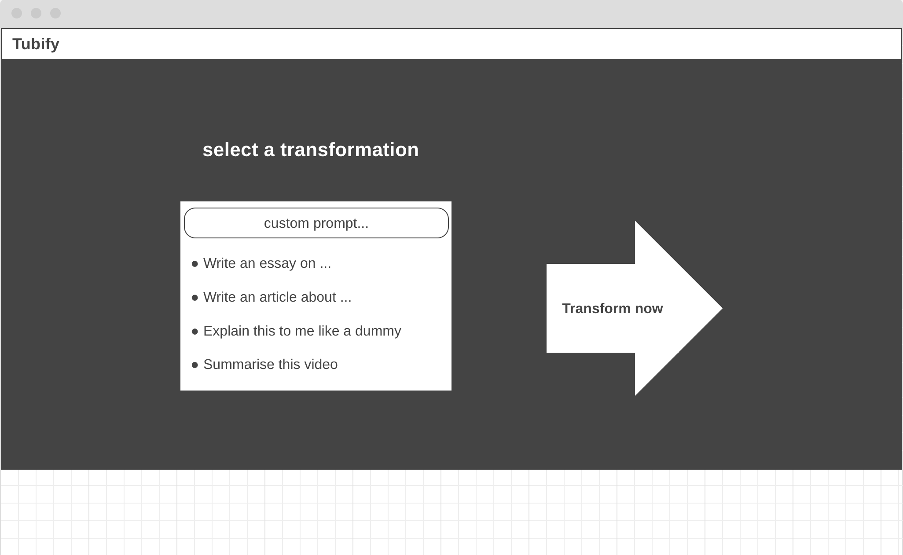

# Project Proposal: YouTube Transcript Transformer
## Background
YouTube Transformer is a unique, user-friendly web application designed to extract transcripts from YouTube videos and transform them into user-friendly textual formats. The application harnesses the power of advanced language models and the YouTube Data API to present video content in a whole new light.

## Functionality & MVPs
In YouTube Transformer, users will be able to:

### 1. Enter YouTube URL: 
 Users can input the URL of any YouTube video of their choice.

### 2. Extract Transcript: 
The app leverages the YouTube Data API to extract transcripts from the input video.

### 3. Transform Transcript: 
Users can transform the transcript into different formats such as 'summary', 'explain for a dummy', 'article', etc. using the GPT-3.5 Turbo model.

### 4. Display Result: 
The transformed text is displayed in a readable, user-friendly format.

In addition, this project will include:

- ### Error Handling: 
Informative error messages will be shown if the video cannot be processed or if the API services are unavailable.

## Wireframes

### Homepage: 

### Once a url has been entered:

### Select a transformation:

## Technologies, Libraries, APIs
The project leverages the following technologies:

### Frontend: 
Pure JavaScript for building the front-end functionality, HTML/CSS for structuring and styling.

- YouTube Data API: Fetches transcripts from YouTube videos.

- OpenAI's GPT-3.5 Turbo Model: Transforms the transcripts into various text formats.

- Express: A minimal backend to serve the webpage and make API calls.

- Webpack: For bundling the JavaScript files.

## Implementation Timeline

### Thursday 
- Figure out how to use both APIs 
- Set up the project skeleton (webpack, proxy server, distinct directories)

### Weekend 
- Get the remote server running for backend. 
- Use user's input url to find target video and display to the webpage. 
- Correctly retreive the script in the background from a user's url.
- Should also seperately be able to take a video script and prompt, and output the LLM response to screen.

### Monday
- Allow users to transform the transcript into different text formats (full functionality).
- Start working on error handling features
- Start working on the dynamic JS features

### Tuesday: 
- Ensure error handling is working correctly. 
- Start working on the UI/UX part of the application.

### Wednesday: 
- Improvements, improvements, improvements

### Thursday Morning: 
- Complete any remaining aspects of the project. 
- Deploy to GitHub Pages.